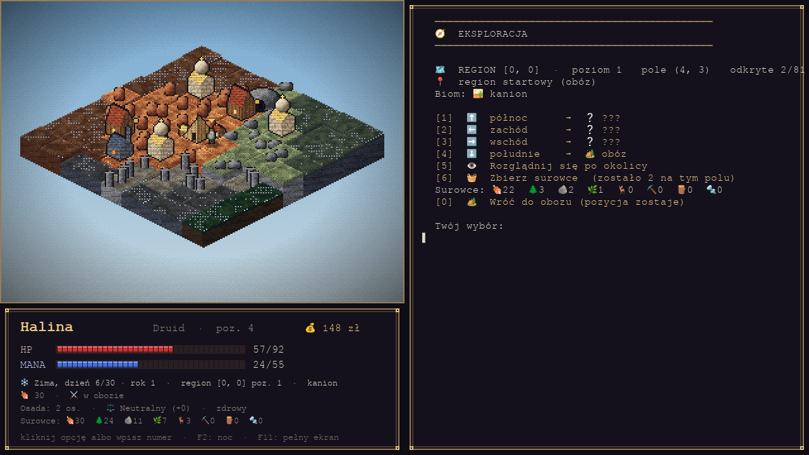

# Port na Unity

Przeniesienie gry z Pythona na Unity i C#. Wersja pythonowa w katalogu głównym
**zostaje nietknięta** — służy jako wzorzec, do którego port się porównuje,
i dalej jest grywalna (`python main.py`).



## Jak to uruchomić

Potrzebne: Unity (2021.3 albo nowszy; starczy zwykły szablon 3D albo 2D).

1. **Unity Hub → Add → Add project from disk → wskaż katalog `unity/GraSimply`.**
2. W edytorze otwórz scenę `Assets/Scenes/Gra.unity` i naciśnij **Play**.

Nie zakładaj nowego projektu — `unity/GraSimply` **jest** projektem. Resztę
ustawień (`ProjectSettings/*.asset`, `Packages/manifest.json`) Unity dorobi
samo przy pierwszym otwarciu; w repozytorium jest tylko tyle, ile potrzebuje
Hub, żeby rozpoznać katalog.

Projekt deklaruje wersję **2022.3.0f1** w `ProjectSettings/ProjectVersion.txt`.
Jeśli masz inną, Hub zapyta, czy otworzyć swoją — zgódź się, to normalne
i bezpieczne. Żeby pytał rzadziej, wpisz tam swoją wersję (dokładnie tak,
jak pokazuje ją Hub, np. `6000.0.23f1`):

```
m_EditorVersion: 2022.3.0f1
```

Jeśli scena nie chce się otworzyć (zdarza się przy dużej różnicy wersji
edytora), użyj menu **Gra Simply → Utwórz scenę gry** — zapisze świeżą scenę
tym Unity, które masz, i doda ją do ustawień budowania.

### Sterowanie

| Klawisz | Działa |
| --- | --- |
| cyfry + Enter | wybór opcji z menu |
| klik w opcję | to samo co wpisanie jej numeru |
| strzałki | ruch po mapie podczas wyprawy |
| spacja | zbadaj pole / potwierdź „naciśnij Enter” |
| kółko myszy | przewijanie konsoli |
| F2 | dzień / zmierzch |
| F11 | pełny ekran |

Gdyby zamiast ikon pokazały się puste prostokąty, wyłącz **Pokazuj emoji**
w inspektorze obiektu `Gra`. Tekst straci ikonki, ale zostanie czytelny.

## Jak to jest zbudowane

Trzy warstwy, każda w osobnej bibliotece (`asmdef`):

| Warstwa | Katalog | Zależności |
| --- | --- | --- |
| **Logika** | `Assets/Scripts/Logika` | brak — nie zna nawet UnityEngine |
| **Grafika** | `Assets/Scripts/Grafika` | tylko Logika; rysuje do bufora pikseli |
| **Gra** | `Assets/Scripts/Gra` | Unity; jeden `MonoBehaviour` spinający całość |

Logika i Grafika mają w pliku `asmdef` ustawione `noEngineReferences`, więc
**nie da się** w nich przypadkiem użyć Unity — kompilator na to nie pozwoli.
Dzięki temu obie warstwy budują się i testują zwykłym `dotnet`, bez edytora.

### Dwie decyzje, które warto znać

**Logika chodzi na osobnym wątku.** Wersja pythonowa była blokującym programem
konsolowym: `input()` zatrzymywał wykonanie, a okno pygame pompowało zdarzenia
od środka. W Unity nie wolno zablokować głównego wątku, bo stanęłoby rysowanie.
Zamiast przepisywać całą grę na maszynę stanów — co byłoby ogromną robotą
i rozjechałoby zachowanie — logika dostała własny wątek, a między nią
a rysowaniem stoi kolejka (`KonsolaKolejkowa`). Pętle w rodzaju
`while (true) { … Czytaj(); }` przeniosły się jeden do jednego.

**Rysowanie dostaje migawkę, nie żywy stan.** Wątek rysujący nigdy nie zagląda
do list i słowników postaci — logika zamraża je w `Migawka` tuż przed tym, jak
zablokuje się na pytaniu. Bez tego prędzej czy później trafiłby na słownik
w połowie zmiany, co w .NET kończy się wyjątkiem, a nie brzydką klatką.
Animacja (woda, ogień, chód) liczy się z czasu, więc obraz żyje między
migawkami.

**Pixelart jest liczony w kodzie, nie wczytywany z plików.** Tak jak w wersji
pythonowej: kafle, roślinność, budynki i sylwetki powstają z szumu, ramp
kolorów i ditheringu Bayera. Nie ma żadnych PNG-ów do trzymania, a `Pulpit`
składa całą klatkę 1280×720 i oddaje ją Unity jako jedną teksturę. Unity dokłada
tylko tekst, bo własny krój bitmapowy nie udźwignąłby emoji z komunikatów gry.

## Testy

```bash
cd unity/Testy
dotnet run
```

Testy porównują port z wersją pythonową — nie „mniej więcej”, tylko dokładnie:

* **generator losowy**: MT19937 przepisany z CPythona razem z semantyką
  `random()`, `getrandbits()`, `randint()`, `choice()` i `sample()`. Ten sam
  seed musi dać tę samą sekwencję;
* **świat**: pełne regiony 9×9 (biomy i punkty) dla trzynastu kombinacji seeda
  i współrzędnych — w tym regiony dalekie i ujemne;
* **pixelart**: kafle wszystkich sześciu biomów, klatki animacji wody, mgła
  wojny, obwódka pola, roślinność, skały i pięć sylwetek klas — **piksel
  w piksel**, bajt w bajt;
* **postać**: progi EXP, statystyki startowe pięciu klas, dwanaście awansów
  każdej, kalendarz, karma, rany i głód;
* **wątki**: że logika faktycznie się blokuje, że odpowiedź do niej dochodzi,
  że zamknięcie okna budzi ją wyjątkiem i że cała gra przechodzi na dwóch
  wątkach.

Wzorce leżą w `Testy/wzorce/` i generuje je `narzedzia/wzorce.py` z wersji
pythonowej. Po zmianie logiki świata albo rysowania trzeba je odświeżyć:

```bash
python unity/narzedzia/wzorce.py
```

CI robi to sam przy każdym pushu i sprawdza, czy zapisane wzorce są aktualne.

## Podgląd grafiki bez Unity

Warstwa Grafika nie potrzebuje edytora, więc klatkę da się wyrenderować
do pliku i obejrzeć:

```bash
cd unity/Testy && dotnet run -- --podglad ../podglad && cd ../..
python unity/narzedzia/podglad.py unity/podglad
```

Obrazki lądują w `unity/podglad/`. Przydaje się, gdy zmieniasz coś w rysowaniu
i chcesz zobaczyć efekt szybciej, niż trwa start Unity.

## Co jest przeniesione, a co nie

Port idzie etapami. **Etap 1 (zrobiony)** to pionowy wycinek: od ekranu
tytułowego, przez tworzenie postaci, obóz i wyprawę, po ruch po mapie,
zbieractwo i zwiad z testem k20.

| Przeniesione | Czeka na etap 2 |
| --- | --- |
| trwały świat, regiony, mgła wojny | walka i wrogowie (`combat.py`, `enemy.py`) |
| pięć klas, atrybuty, awanse, testy k20 | rozmowy i dialogi (`rozmowy.py`, `dialogues.py`) |
| kalendarz, pory roku, karma | osada: budynki, osadnicy, więzi, najazdy |
| prowiant, głód, rany | rzemiosło, handel, questy |
| zbieractwo i magazyn surowców | zapis i wczytywanie gry |
| scena mapy, HUD, konsola | pochodzenie, talenty, myśli |

Miejsca, w których dojdą brakujące systemy, są w kodzie oznaczone komentarzem
`Etap 2`. Wersja pythonowa ma je wszystkie i działa — port je dogania.
